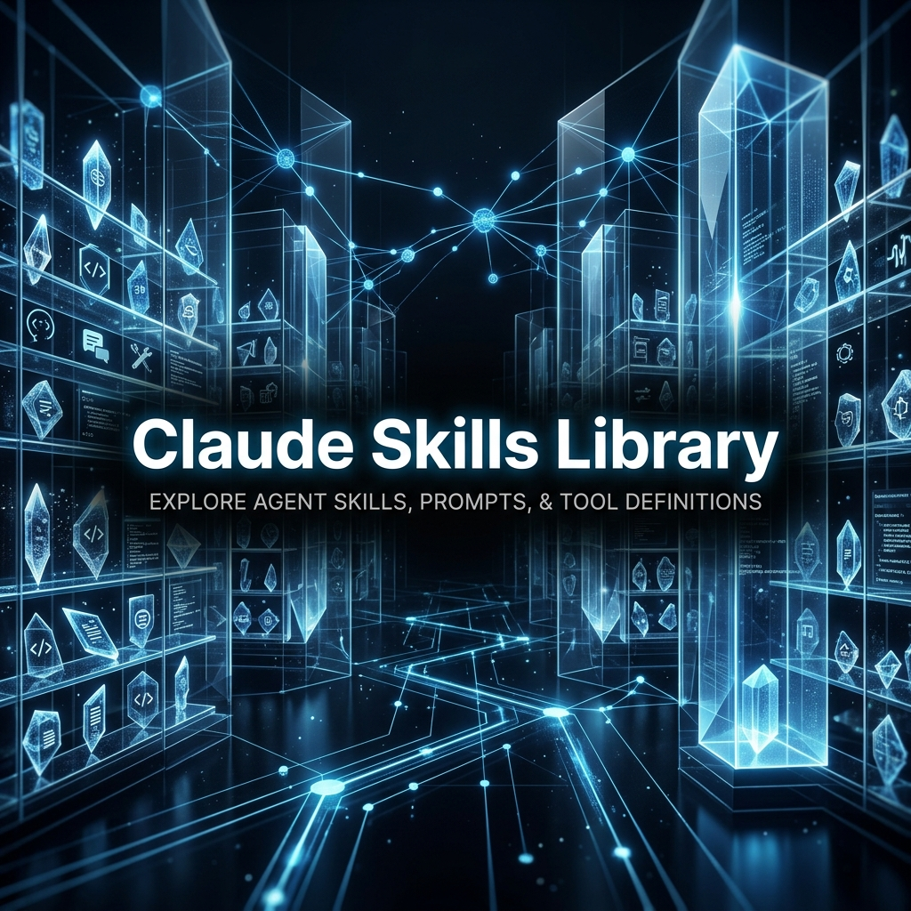

<p align="center">
  
</p>

<h1 align="center">Claude Skills Library</h1>

<p align="center">
  <strong>The definitive curation of professional-grade, research-backed agent skills for Claude Code and the Anthropic ecosystem.</strong>
</p>

<p align="center">
  <a href="#the-skills-thesis">The Thesis</a> ·
  <a href="#architecture-standard">Architecture</a> ·
  <a href="#curated-skills">Skill Catalog</a> ·
  <a href="#deployment">Deployment</a> ·
  <a href="CONTRIBUTING.md">Contribute</a>
</p>

<p align="center">
  <a href="https://awesome.re"></a>
  
  <a href="LICENSE"></a>
</p>

---

## 🏛️ The Skills Thesis

A powerful LLM is only as effective as the context and constraints it operates within. Generic system prompts result in generic outputs.

This repository curates **expert-level agent skills**—dense, 3,000+ word cognitive architectures that transform Claude into a domain specialist. Rather than simple prompts, these skills define explicit workflows, strict quality gates, and specific reasoning models (e.g., Socratic questioning, WCAG 2.2 auditing, MCP server design) grounded in 2025 best practices.

---

## 🏗️ Architecture Standard

*Every skill in this library must adhere to a strict structural standard.*

<details open>
<summary><strong>The Skill Blueprint</strong></summary>
<br>

All accepted skills must be provided as a `SKILL.md` file containing:

1. **YAML Frontmatter**: For agent-harness trigger detection.
2. **Cognitive Identity**: The explicit persona and constraints the agent must adopt.
3. **Workflow Rules**: Step-by-step operational instructions.
4. **Quality Gates**: The specific criteria an output must meet before the agent is allowed to finalize the task.
5. **Anti-Patterns**: Explicit instructions on what the agent must *never* do.
</details>

---

## 📚 Curated Skill Catalog

*High-density cognitive overlays for Claude.*

<details open>
<summary><strong>Software & Systems Engineering</strong></summary>
<br>

- **[MCP Architecture Expert](free-skills/mcp-architecture/SKILL.md)** — Transforms Claude into a Model Context Protocol (MCP) design specialist. Enforces stateless server design, proper tool definition, and rigorous security boundaries.
- **[UI/UX Design Expert](free-skills/ui-ux-design/SKILL.md)** — Grounds Claude in WCAG 2.2 compliance, atomic design principles, and modern design token architecture.
</details>

<details open>
<summary><strong>Cognitive & Philosophical Frameworks</strong></summary>
<br>

- **[Greek Philosopher](free-skills/greek-philosopher/SKILL.md)** — Forces Claude to use Socratic questioning (Elenchus) and Stoic principles (Wisdom, Courage, Justice, Temperance) to help users examine complex decisions.
- **[Spartan Warrior](free-skills/spartan-warrior/SKILL.md)** — A strictly laconic, action-oriented overlay. Refuses to philosophize; demands immediate, disciplined execution.
</details>

*(Note: The catalog is continuously expanding. Check the `free-skills/` directory for the latest additions.)*

---

## ⚡ Deployment & Usage

### 1. Claude Code Integration

Skills are designed to be ingested by Claude Code or similar agentic CLI harnesses.

```bash
# Clone the library
git clone https://github.com/frankxai/claude-skills-library.git

# Symlink desired skills into your Claude Code config
ln -s ~/claude-skills-library/free-skills/mcp-architecture ~/.claude/skills/mcp-architecture
```

### 2. Invocation

Once installed, the skills activate via their defined trigger words or through explicit invocation:

- *"Help me design a new data connector. Use the MCP Architecture Expert skill."*
- *"Review this React component using the UI/UX Design Expert."*

---

## 🤖 The Architecture (Maintained by ACOS)

This repository is not a static list; it is a living, agent-managed node within the **Agentic Creator Operating System (ACOS)**. 

### How We Drink Our Own Champagne
To ensure absolute quality and up-to-date information, this repo is maintained by our internal agent swarms via `.agent-harness.json`. Our agents are strictly constrained by:
1. **The Visual QA Gate**: Ensuring all generated heroes (`assets/hero.png`) meet high-end glassmorphism and tech-noir standards.
2. **Automated Link Audits**: Weekly lychee workflows and active ping scripts ensure 0% link rot.
3. **FrankX Design Constraints**: Code and formatting must align with `DESIGN_TASTE.md`.

*If you are building an Agent OS, you must build the harnesses that manage it.*

---

## 🤝 Contributing

We welcome high-density, rigorously tested skills that elevate Claude's capabilities. 

We do **not** accept simple, one-paragraph prompts. Submissions must include complete workflows, constraints, and adherence to the Architecture Standard. Please review our [Contribution Guidelines](CONTRIBUTING.md) before opening a PR.

Released under the [MIT License](LICENSE).
