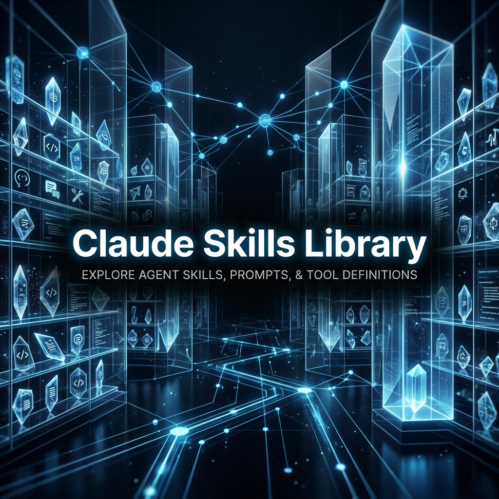

<p align="center">
  
</p>

<h1 align="center">Agent Skills Library</h1>

<p align="center">
  <strong>The open, research-backed Agent Skills standard (<code>SKILL.md</code>) for Claude Code, OpenAI Codex, Grok Build, Google Antigravity, and Cursor.</strong>
</p>

<p align="center">
  <a href="#the-agent-skills-thesis">The Thesis</a> ·
  <a href="#universal-runtime-support">Runtimes</a> ·
  <a href="#curated-skill-catalog">Skill Catalog (22)</a> ·
  <a href="#quick-installation">Quick Install</a> ·
  <a href="#specialized-starlight-plugins">Specialized Plugins</a> ·
  <a href="CONTRIBUTING.md">Contribute</a>
</p>

<p align="center">
  <a href="https://awesome.re"></a>
  
  
  
  
  
  <a href="LICENSE"></a>
</p>

---

## 🏛️ The Agent Skills Thesis

A frontier LLM is only as effective as the context and constraints it operates within. Generic system prompts yield generic outputs.

When Anthropic introduced the folder-based skill structure (`SKILL.md` with YAML frontmatter), the industry recognized an enduring insight: **one portable folder format can define cognitive architectures across every agent harness.**

This repository curates **22 expert-level agent skills**—dense, production-proven cognitive overlays that transform any autonomous coding agent into a domain specialist. Rather than shallow prompts, these skills define explicit multi-step workflows, strict quality gates, and structured reasoning models grounded in 2025–2026 engineering standards.

---

## 🌐 Universal Runtime Support

Every skill in this repository is 100% vendor-neutral and loads out of the box in:

| Runtime / Harness | Discovery Mechanism | Config Location |
| :--- | :--- | :--- |
| **Claude Code** | Native Agent Skills | `~/.claude/skills/` or `npx skills add` |
| **OpenAI Codex** | Native Agent Skills & Plugins | `~/.codex/skills/` or `/plugin install` |
| **Grok Build (xAI)** | Progressive Skills | `~/.grok/skills/` or `extra_skill_dirs` |
| **Google Antigravity**| Workspace & Plugins | `~/.gemini/antigravity/skills/` |
| **Cursor & Windsurf** | Agent Rules & Toolpacks | `.cursor/rules/` or local junctions |

---

## ⚡ Quick Installation

### Option 1: Using the Universal Skills CLI (`npx skills`)

```bash
# Add a single skill to Claude, Codex, or Cursor
npx skills add frankxai/claude-skills-library --skill mcp-architecture

# Install directly into Grok Build
npx skills add frankxai/claude-skills-library --skill langgraph-patterns --dest ~/.grok/skills
```

### Option 2: Install as an Agent Plugin (Codex & Claude)

This repository includes a native [`plugin.json`](plugin.json), `.codex-plugin/`, and `.claude-plugin/`:

```bash
# In OpenAI Codex
codex /plugin install frankxai/claude-skills-library

# In Claude Code
claude plugin install frankxai/claude-skills-library
```

### Option 3: Direct Git Symlink / Junction

```bash
# Clone the library
git clone https://github.com/frankxai/claude-skills-library.git ~/claude-skills-library

# Link into Claude Code
ln -s ~/claude-skills-library/free-skills/mcp-architecture ~/.claude/skills/mcp-architecture

# Link into OpenAI Codex
ln -s ~/claude-skills-library/free-skills/mcp-architecture ~/.codex/skills/mcp-architecture
```

---

## 📚 Curated Skill Catalog

All 22 production-grade skills are located in [`free-skills/`](free-skills/):

### 1. AI Agents & Multi-Agent Systems

- **[Claude SDK](free-skills/claude-sdk/SKILL.md)** — Build autonomous AI agents using Claude Agent SDK with computer use, tool calling, MCP integration, and production Anthropic patterns.
- **[OpenAI AgentKit](free-skills/openai-agentkit/SKILL.md)** — Build production-ready multi-agent systems using OpenAI AgentKit and Agents SDK with handoffs and routines.
- **[LangGraph Patterns](free-skills/langgraph-patterns/SKILL.md)** — Build production agentic workflows with LangGraph using graph orchestration, state machines, and human-in-the-loop gates.
- **[Oracle ADK](free-skills/oracle-adk/SKILL.md)** — Build enterprise agentic applications on OCI using Oracle Agent Development Kit and multi-agent coordination.
- **[Oracle Agent Spec](free-skills/oracle-agent-spec/SKILL.md)** — Design framework-agnostic AI agents using Oracle Open Agent Specification (JSON/YAML) for maximum portability.

### 2. Architecture & Cloud Systems

- **[MCP Architecture Expert](free-skills/mcp-architecture/SKILL.md)** — Master the Model Context Protocol (MCP). Stateless server design, resources, tools, prompts, and security boundaries.
- **[OCI Services Expert](free-skills/oci-services-expert/SKILL.md)** — Enterprise Oracle Cloud Infrastructure architectures, cost optimization, and deployment patterns.
- **[Oracle Database Expert](free-skills/oracle-database-expert/SKILL.md)** — 23ai AI Vector Search, PL/SQL optimization, connection pooling, and performance diagnostics.
- **[Product Management Expert](free-skills/product-management-expert/SKILL.md)** — System-level product definition, PRD drafting, feature mapping, value proposition validation, and pricing strategy.

### 3. Frontend & Design Systems

- **[Next.js & React Expert](free-skills/nextjs-react-expert/SKILL.md)** — Production patterns for Next.js 16 (App Router), React 19, server actions, and Vercel performance budgets.
- **[UI/UX Design Expert](free-skills/ui-ux-design-expert/SKILL.md)** — Design systems, WCAG 2.2 accessibility, atomic design principles, and modern token architecture.
- **[Framer Expert](free-skills/framer-expert/SKILL.md)** — Interactive prototypes to production Framer sites with Framer Motion, CMS integration, and MCP servers.

### 4. Media, Creative & Audio

- **[Video Production Workflow](free-skills/video-production-workflow/SKILL.md)** — Programmatic 3-layer video pipeline: Keyframe generation, cinematic motion (Veo/Luma/fal), dynamic Remotion assembly.
- **[Suno AI Mastery](free-skills/suno-ai-mastery/SKILL.md)** — Prompt engineering and music generation with Suno AI v4/v4.5 across all genres with structure tags.
- **[Social Media Strategy](free-skills/social-media-strategy/SKILL.md)** — Platform-specific distribution, algorithmic reach, audience growth, and analytics-driven content execution.

### 5. Mindset, Cognition & Discipline

- **[Feynman Thinking](free-skills/feynman-thinking/SKILL.md)** — Simple first-principles explanations, architectural mental models, and relentless reduction of unnecessary complexity.
- **[Todo Discipline](free-skills/todo-discipline/SKILL.md)** — Read-verification checklist protocol. Ensures task state strictly mirrors reality and stops hallucinated completion.
- **[Greek Philosopher](free-skills/greek-philosopher/SKILL.md)** — Socratic inquiry (Elenchus) and Stoic principles (Wisdom, Courage, Justice, Temperance) for high-stakes decisions.
- **[Spartan Warrior](free-skills/spartan-warrior/SKILL.md)** — Laconic, action-oriented discipline. Cuts hesitation, executes relentlessly, and focuses on output.
- **[FrankX Daily Execution](free-skills/frankx-daily-execution/SKILL.md)** — Conscious creation workflow using Starlight meta-intelligence and high-output operating routines.
- **[Health & Nutrition Expert](free-skills/health-nutrition-expert/SKILL.md)** — Longevity, metabolic health, gut microbiome science, and evidence-based nutrition protocols.
- **[Gym Training Expert](free-skills/gym-training-expert/SKILL.md)** — Evidence-based exercise science, hypertrophy biomechanics, and progressive overload protocols.

---

## 🚀 Specialized Starlight Plugins

For complete, end-to-end domain intelligence swarms, see our flagship compiled plugins:

- **[starlight-architect](https://github.com/frankxai/skills)** (`frankxai/skills`) — Enterprise AI systems design, multi-agent swarms, cloud infrastructure, and autonomous reliability.
- **[starlight-creator](https://github.com/frankxai/creator-skills)** (`frankxai/creator-skills`) — High-end brand design, cinematic video production, Suno music orchestration, and multi-format publishing.

---

## 🏗️ Architecture Standard

Every skill in this library strictly adheres to the standard:

```
skill-name/
├── SKILL.md          # YAML frontmatter + cognitive identity + workflows + quality gates
├── scripts/           # (Optional) deterministic execution scripts
└── references/        # (Optional) deep domain documentation & schemas
```

### Frontmatter Schema

```yaml
---
name: "Skill Display Name"
description: "Precise summary of capabilities and trigger contexts (< 200 characters)."
version: "1.0.0"
---
```

---

## 🤝 Contributing

We welcome high-density, rigorously tested skills. Submissions must include complete workflows, explicit quality gates, and anti-patterns. Please review our [Contribution Guidelines](CONTRIBUTING.md) before opening a pull request.

Released under the [MIT License](LICENSE).

<!-- kernel:start v393ecb58 -->
## Built on the Omotenashi Kernel

段取り *prep* · おもてなし *serve* · 見立て *build with what you are given* · 場を読む *read the room*

Every agent turn ends with a made thing, never a status report.  
Free and MIT — [read the kernel](https://github.com/frankxai/omotenashi-kernel).
<!-- kernel:end -->
