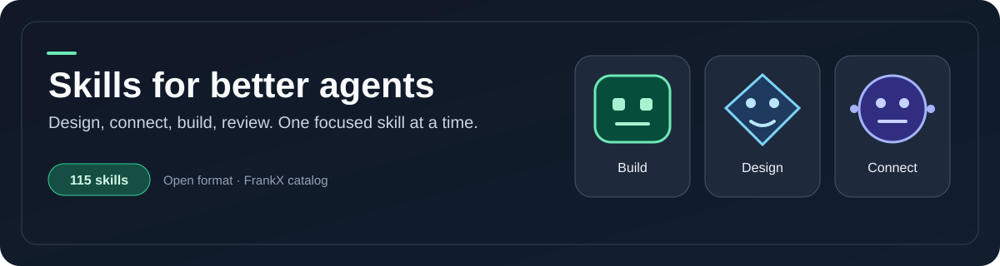
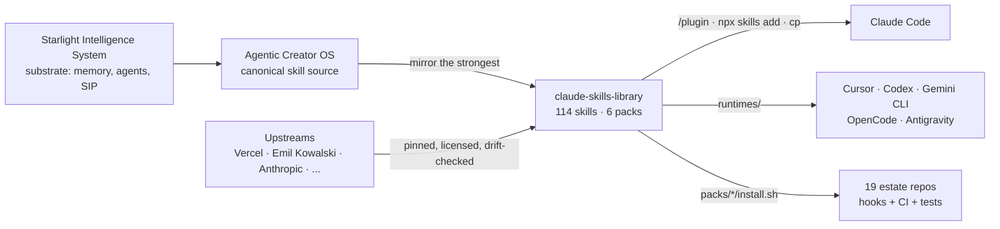

<p align="center"></p>

<div align="center">

# Claude Skills Library

### 114 Agent Skills for every skills-aware runtime, and 6 enforcement packs for Claude Code

Skills teach an agent a domain. Packs make the agent go through the gate. This is the only public
library that ships both, with provenance pinned to commits, counts that check themselves in CI, and
hooks that block "done" until the evidence exists.

[](LICENSE)
[](docs/CATALOG.md)
[](#packs-skills-that-enforce)
[](#works-with-six-runtimes)
[](https://github.com/frankxai/claude-skills-library/actions/workflows/validate.yml)
[](https://github.com/frankxai/claude-skills-library/actions/workflows/pack-tests.yml)
[](CONTRIBUTING.md)

[**Install**](#install) · [**Packs**](#packs-skills-that-enforce) · [**Catalog**](docs/CATALOG.md) · [**Strategy**](docs/STRATEGY.md) · [**Contribute**](CONTRIBUTING.md) · [**FAQ**](#faq)

</div>

---

## Install

Three ways in. Pick one.

```text
# 1. Claude Code plugin — auto-updating, skills discovered on their own
/plugin marketplace add frankxai/claude-skills-library
/plugin install claude-skills-library@claude-skills-library
```

```bash
# 2. skills.sh — the top-level skills, or a curated lane
#    (the skills nested under anthropic/, creative/ and technical/ come via the plugin or a clone)
npx skills add frankxai/claude-skills-library
npx skills add frankxai/skills            # AI architects: MCP, orchestration, model routing
npx skills add frankxai/creator-skills    # creators: video, music, images, brand voice
```

```bash
# 3. Clone and copy only what you want
git clone https://github.com/frankxai/claude-skills-library.git ~/claude-skills-library
mkdir -p ~/.claude/skills
cp -r ~/claude-skills-library/free-skills/mcp-architecture ~/.claude/skills/   # one
cp -r ~/claude-skills-library/free-skills/* ~/.claude/skills/                  # all
```

Some skills are namespaced (`free-skills/anthropic/pdf`). Copy the folder that directly contains the
`SKILL.md`. Restart Claude Code and the skills are discovered.

**Then work.** Skills fire on their own from their `description`, or you name one:

```text
"Design an MCP server with the mcp-architecture skill."
"Review this PR with the github-code-review skill."
"Run the verification-quality skill before you call this done."
```

---

## What is here

Two layers. The first is what every skills repo has. The second is what none of the large ones ship.

| Layer | What it is | Where |
|---|---|---|
| **Skills** | 114 self-contained `SKILL.md` folders. Spec-validated frontmatter, trigger-rich descriptions, deep guidance in `references/` loaded only on use. | [`free-skills/`](free-skills) · [catalog](docs/CATALOG.md) |
| **Packs** | 6 installable contracts. Each bundles the skills for one kind of work with whatever enforcement it has: hooks, CI scripts, drift checks, or templates. The packs table below says which. | [`packs/`](packs) |

A skill is loaded when the task matches its description. That makes it *available*, not *mandatory*.
A pack adds what turns a suggestion into a default, and the mechanism differs by pack.
`web-excellence` installs three hooks: a `SessionStart` note, a `PreToolUse` reminder on the first UI
edit, and a `Stop` hook that blocks once if UI changed with no audit, each shipped with the test that
proves it cannot be satisfied by its own reminder text. `estate-guard` installs a `PreToolUse` gate
that denies the hard stops and a taint hook for fetched content. `routine-contract` ships a CI
workflow and a digest primitive that fails the run when nothing durable was written.
`risk-classifier` ships a fail-closed classifier script for you to wire into CI. `agent-infrastructure`
installs skills and checks installed copies against canon. `film-excellence` installs a skill and
templates and is advisory.

---

## Packs: skills that enforce

Installed into 19 repositories across the FrankX, Starlight, and Arcanea estate as of 2026-10-09.
Re-run an installer to upgrade. An installed skill that differs is moved to `.claude/skills/.replaced/<name>`, and only the most recent set-aside copy is kept, so commit or copy a customised skill before re-running. All but `risk-classifier` accept `--dry-run` to show the diff first.

| Pack | What it gates | Enforced by |
|---|---|---|
| [`web-excellence`](packs/web-excellence) | Website and web-design work. Sequences a live Vercel Web Interface Guidelines audit, motion review, Core Web Vitals, and before/after screenshots at 375 / 768 / 1440. "Done" needs evidence, never a self-assigned score. | 11 vendored skills pinned to upstream commits (Vercel, Emil Kowalski, nextlevelbuilder, arvindrk, Leonxlnx), 3 native skills, 3 hooks, 18 tests |
| [`estate-guard`](packs/estate-guard) | The agentic surface: workflows, hooks, settings, MCP configs, skills, API routes. Denies force-push to main, recursive deletes, `curl \| sh`, permission bypass. Marks instruction-shaped text in fetched or MCP output as data. | Scanner, 3 hooks, weekly CI, severity-triaged fix patterns |
| [`agent-infrastructure`](packs/agent-infrastructure) | The multi-agent operational layer: swarm orchestration, hive-mind, ReasoningBank memory, hooks, stream chaining, verification, skill tooling. Nine skills that drifted into 2 to 4 divergent copies across five repos now have one canonical source. | Manifest plus installer over `free-skills/`, content hashes, drift check |
| [`risk-classifier`](packs/risk-classifier) | PR readiness. Classifies every changed file against eight risk classes. Unknown fails closed. Secret-shaped content anywhere fails closed. | CI script, `classes.json`, tests |
| [`routine-contract`](packs/routine-contract) | Scheduled agents. Makes it impossible to report `SUCCEEDED` while committing nothing: preflight proves the output sink exists, the digest primitive exits non-zero if it could not persist. | Skill, digest script, fleet drift detector, daily CI, 12 tests |
| [`film-excellence`](packs/film-excellence) | Narrative film and short-form video. Doctrine, dialogue tells that mark machine writing, token contract, crew chairs, eight-stage pipeline. The film counterpart to `web-excellence`. | Native skill, templates, design and taste contracts |

```bash
git clone --depth 1 https://github.com/frankxai/claude-skills-library /tmp/csl
/tmp/csl/packs/web-excellence/install.sh "$PWD"
/tmp/csl/packs/estate-guard/install.sh "$PWD"
```

Then one line in the repo's `CLAUDE.md`: *Website / web-design work goes through the `web-release-gate` skill first.*

---

## Why this library

The largest skills repositories are excellent at *judgment*: how to think about a design, a diff, a
test. They are weak at *proof*. None of them measures anything, produces evidence at real
breakpoints, refuses to let work be called done, or tells you where a vendored skill came from and
whether it has moved upstream since. This library is built around those gaps.

| | Most skills repos | This library |
|---|---|---|
| Skill format | `SKILL.md` | `SKILL.md`, validated in CI for frontmatter, name, description length, filename |
| Provenance | Copied | Third-party skills in the packs are pinned to an upstream commit with the license beside them, re-syncable, drift-checked. The Anthropic reference skills under `free-skills/anthropic/` carry their licenses but not yet pins; closing that is bet 3 in the strategy |
| Enforcement | Advisory | Hooks that block once without an audit, each with a test |
| Counts | Hand-maintained | The README's skill total, pack total, and per-category counts are checked against the tree; a mismatch fails the build |
| Inbound work | Paste it in | A four-gate absorption contract (license, provenance, distinctness, attestation) that refuses rather than warns |
| Scheduled agents | "Report your findings" | A digest primitive that fails the run if nothing durable was written |

The honest gap on our side: **evals**. All 114 in this library read well. None yet ships evidence
that it still behaves under pressure. That is the next moat and the first bet in
[`docs/STRATEGY.md`](docs/STRATEGY.md).

---

## Skill categories

Counts are the groupings in [`docs/CATALOG.md`](docs/CATALOG.md), regenerated from the tree by
[`scripts/generate_catalog.py`](scripts/generate_catalog.py). **114 skills** across 11 categories.

| Category | Count | Examples |
|---|---:|---|
| **AI agents and orchestration** | 16 | `agentic-orchestration`, `swarm-orchestration`, `model-routing`, `ai-architect-review`, `v-swarm` |
| **AI frameworks, MCP and SDKs** | 13 | `mcp-architecture`, `mcp-builder`, `openai-agentkit`, `claude-sdk`, `langgraph-patterns` |
| **Oracle and cloud** | 8 | `oracle-ai-architect`, `oracle-database-expert`, `oci-services-expert`, `ai-architecture` |
| **Web, frontend and animation** | 14 | `nextjs-expert`, `ui-ux-design-expert`, `tailwind`, `gsap`, `three`, `framer-expert` |
| **Engineering workflow and GitHub** | 10 | `github-code-review`, `performance-analysis`, `verification-quality`, `hooks-automation` |
| **Content, writing and brand** | 14 | `brand-voice`, `book-publishing`, `social-media-strategy`, `creator-productivity` |
| **Creative and media production** | 22 | `suno-ai-mastery`, `video-production-workflow`, `hyperframes-media`, `higgsfield-soul-id` |
| **Mind, body and philosophy** | 5 | `greek-philosopher`, `spartan-warrior`, `gym-training-expert`, `health-nutrition-expert` |
| **Documents and productivity** | 6 | `pdf`, `docx`, `pptx`, `xlsx`, `product-management-expert`, `webapp-testing` |
| **Meta and library** | 1 | `contribute-catalog` |
| **Other** | 5 | `feynman-thinking`, `loop-designer`, `loop-orchestrator`, `loop-runner` |

Browse the **[full catalog](docs/CATALOG.md)**, or the generated site at [`docs/index.html`](docs/index.html).

---

## A few to start with

| Skill | Why you would reach for it |
|---|---|
| [`mcp-architecture`](free-skills/mcp-architecture/SKILL.md) | Design an MCP server's resources, tools, prompts, and security from first principles |
| [`ai-architect-review`](free-skills/ai-architect-review/SKILL.md) | Review any system that calls a language model: agent loops, retrieval paths, tool surfaces |
| [`nextjs-expert`](free-skills/nextjs-expert/SKILL.md) | App Router, server/client boundaries, caching, and the production gotchas that bite |
| [`github-code-review`](free-skills/github-code-review/SKILL.md) | Turn a raw diff into a correctness, security, and style review with actionable comments |
| [`model-routing`](free-skills/model-routing/SKILL.md) | Route a task to the cheapest model that can do it well, with the rules written down |
| [`oracle-database-expert`](free-skills/oracle-database-expert/SKILL.md) | Oracle 23ai, Autonomous DB, AI Vector Search, SQL and PL/SQL tuning, HA |
| [`suno-ai-mastery`](free-skills/suno-ai-mastery/SKILL.md) | Prompt-engineer commercial-quality music with Suno v4.5+ |
| [`loop-designer`](free-skills/loop-designer/SKILL.md) | Compile a goal into a file-backed agent loop any coding agent can run unattended |
| [`greek-philosopher`](free-skills/greek-philosopher/SKILL.md) | Socratic questioning and a Stoic read on a hard decision |

---

## How the pieces fit


```mermaid
flowchart LR
    SIS["Starlight Intelligence System<br/>substrate: memory, agents, SIP"] --> ACOS["Agentic Creator OS<br/>canonical skill source"]
    ACOS -->|"mirror the strongest"| LIB["claude-skills-library<br/>114 skills · 6 packs"]
    UP["Upstreams<br/>Vercel · Emil Kowalski · Anthropic · ..."] -->|"pinned, licensed, drift-checked"| LIB
    LIB -->|"/plugin · npx skills add · cp"| CC["Claude Code"]
    LIB -->|"runtimes/"| RT["Cursor · Codex · Gemini CLI<br/>OpenCode · Antigravity"]
    LIB -->|"packs/*/install.sh"| REPOS["19 estate repos<br/>hooks + CI + tests"]
```

Starlight is the substrate. ACOS is where skills are authored and battle-tested first. This repo is
the public, install-from catalog, and the packs are how its standards reach every other repo.

---

## Skills vs. MCP vs. prompts

| | A prompt | An MCP server | An Agent Skill |
|---|---|---|---|
| **What it is** | Text you paste | A connection to tools and data | A model-invoked capability |
| **Gives the agent** | Instructions, once | New actions (APIs, files, DBs) | Expert knowledge plus workflow |
| **Activation** | Manual, every time | Always on once connected | Auto-loads when relevant |
| **Token cost** | Every turn | Tool schemas always present | Near zero until triggered |
| **Portability** | One chat | A server you run | A versioned folder, shared across runtimes |

Use a **skill** to teach the agent *how* to do something well. Use **MCP** to give it *access* to a
system. Use a **prompt** for a one-off. Many skills here pair with an MCP server.

---

## Works with six runtimes

Agent Skills are a portable format. One adapter guide per runtime lives in [`runtimes/`](runtimes/).

| Runtime | Maturity | Guide |
|---|---|---|
| Claude Code | Native | [`runtimes/claude-code.md`](runtimes/claude-code.md) |
| Antigravity (`agy`) | Substrate-compatible | [`runtimes/antigravity.md`](runtimes/antigravity.md) |
| OpenCode | Adapter pattern | [`runtimes/opencode.md`](runtimes/opencode.md) |
| Codex CLI | Per-skill MCP wrap | [`runtimes/codex.md`](runtimes/codex.md) |
| Gemini CLI | Per-skill template | [`runtimes/gemini-cli.md`](runtimes/gemini-cli.md) |
| Cursor | Per-skill convert | [`runtimes/cursor.md`](runtimes/cursor.md) |

The rationale for MCP as the universal bridge is in [`MULTI_RUNTIME.md`](MULTI_RUNTIME.md).

---

## Anatomy of a skill

```
free-skills/<skill-name>/
├── SKILL.md          # required: frontmatter + instructions
├── references/       # optional: deep docs loaded on demand
├── scripts/          # optional: executable helpers the agent runs
└── assets/           # optional: templates, fonts, icons used in output
```

```yaml
---
name: mcp-architecture          # lowercase, hyphenated, 64 chars or fewer
description: Design and implement MCP servers... Use when architecting an MCP server...
---
```

The `description` is the most important line. It is what the model uses to decide *when* to load
the skill. State what it does and when to use it, with trigger keywords.

Authoring standard: [`spec/README.md`](spec/README.md). Start here: [`template/SKILL.md`](template/SKILL.md).

---

## Quality and validation

Zero-dependency scripts enforce the standard on every push and pull request
([`validate.yml`](.github/workflows/validate.yml), [`pack-tests.yml`](.github/workflows/pack-tests.yml),
[`catalog-check.yml`](.github/workflows/catalog-check.yml)):

```bash
python3 scripts/validate_skills.py           # frontmatter + structure, exits non-zero on failure
python3 scripts/generate_catalog.py --check  # docs/CATALOG.md matches the tree
python3 scripts/generate_site.py --check     # docs/index.html matches the tree
python3 scripts/check_counts.py              # README counts match the tree
python3 scripts/check_links.py               # no broken internal links
node scripts/build-catalog.mjs --check       # catalog/skills.json matches the marketplace
node --test scripts/tests/absorb.test.mjs    # the four absorption gates still refuse
```

Inbound external work runs through [`ABSORPTION.md`](ABSORPTION.md): license, provenance,
distinctness, attestation. `node scripts/absorb.mjs` refuses rather than warns. What has entered
is recorded in [`ABSORBED.md`](ABSORBED.md).

---

## Catalog site

`scripts/generate_site.py` renders the catalog to `docs/index.html`. It deploys as a static site to
Vercel with the committed [`vercel.json`](vercel.json), or to GitHub Pages from the `docs/` folder.

[](https://vercel.com/new/clone?repository-url=https%3A%2F%2Fgithub.com%2Ffrankxai%2Fclaude-skills-library)

---

## Strategy

The plan to make this the reference skills library, in one page: [`docs/STRATEGY.md`](docs/STRATEGY.md).
The short version:

1. **Evals before volume.** Ship the eval suite, the passing cases, and the failing ones, for the top skills first.
2. **Packs are the product.** Enforcement, provenance, and tests are what a skills directory cannot give you.
3. **Absorb patterns, not prose.** The best skills from other libraries enter through the four gates, with credit, or are depended on, never pasted.
4. **One canonical copy.** Skills that exist in several estate repos get mirrored here and installed back from here.

---

## Community

- [Ask a question](https://github.com/frankxai/claude-skills-library/discussions/categories/q-a), [share a working example](https://github.com/frankxai/claude-skills-library/discussions/categories/show-and-tell), or [suggest an idea](https://github.com/frankxai/claude-skills-library/discussions/categories/ideas).
- [Report a bug or request a skill](https://github.com/frankxai/claude-skills-library/issues/new/choose) with the affected skill and a small, shareable example.
- [Contribute a fix or skill](CONTRIBUTING.md). Evidence from real use and clear source attribution are what get a PR merged.
- [Report a vulnerability privately](SECURITY.md).

See [`SUPPORT.md`](SUPPORT.md) for routing and [`CODE_OF_CONDUCT.md`](CODE_OF_CONDUCT.md) for participation. Remove credentials and private material before posting.

---

## Contributing

1. Read [`CONTRIBUTING.md`](CONTRIBUTING.md) and the [authoring standard](spec/README.md).
2. Copy [`template/`](template/) to `free-skills/<skill-name>/` and write your `SKILL.md`.
3. Run `python3 scripts/validate_skills.py` and `python3 scripts/generate_catalog.py` until both are clean.
4. Open a pull request.

---

## Related repositories

- **[frankxai/skills](https://github.com/frankxai/skills)** and **[frankxai/creator-skills](https://github.com/frankxai/creator-skills)**: the curated, actively maintained lanes for AI architects and for creators. This library is the full catalog behind them.
- **[frankxai/agentic-creator-os](https://github.com/frankxai/agentic-creator-os)**: the canonical, larger source for skills, agents, and commands. New skills are authored and battle-tested there first.
- **[frankxai/Starlight-Intelligence-System](https://github.com/frankxai/Starlight-Intelligence-System)**: the substrate. Persistent context, memory, and the multi-agent layer the skills run on.
- **[frankxai/starlight-design-intelligence](https://github.com/frankxai/starlight-design-intelligence)**: the design and editorial kernel the `web-excellence` pack enforces.

---

## FAQ

**Does loading 114 skills bloat my context?**
No. Only each skill's `name` and `description` is preloaded for routing. The body loads when a skill
triggers, and `references/` load only when read. A library of 114 costs almost nothing until a skill fires.

**How does the right skill get picked from a library this large?**
By the `description`. Every skill states what it does and when to use it with explicit trigger
keywords. If one mis-triggers, sharpen its description. PRs welcome.

**Do I have to install all of them?**
No. Install the plugin for everything, `npx skills add` a curated lane, or copy the folders you want.

**Is this affiliated with Anthropic?**
No. It is an independent, MIT-licensed library built on Anthropic's open Agent Skills format. Skills
under `free-skills/anthropic/` are upstream reference skills that retain their original licenses.

**Can I use these outside Claude Code?**
Yes. See [`runtimes/`](runtimes/) for Antigravity, OpenCode, Codex, Gemini CLI, and Cursor.

---

## Would you pay for a skill that proves it works?

Every first-party skill here is free and MIT. That is not changing. Skills under `free-skills/anthropic/` keep Anthropic's own terms.

A skill is prose until something tests it. The idea on the table: a pack where every skill ships
with its eval suite, the cases it passes, and the cases it fails. There is no paid product today.
Before building one, say whether it should exist, and name the band.

**[Tell us what it is worth](https://github.com/frankxai/claude-skills-library/discussions/new?category=ideas&title=Skills%20with%20evals)**

The first fifty people to answer get one skill with its full eval suite and run output, free. At
fifty answers the eval harness is published open-source regardless.

---

## License

MIT. See [LICENSE](LICENSE). Imported skills retain their upstream licenses, recorded in
[`THIRD_PARTY_NOTICES.md`](THIRD_PARTY_NOTICES.md) and in each vendored folder.

---

<div align="center">


**[Star the repo](https://github.com/frankxai/claude-skills-library)** · **[Catalog](docs/CATALOG.md)** · **[Issues](https://github.com/frankxai/claude-skills-library/issues)** · **[Discussions](https://github.com/frankxai/claude-skills-library/discussions)**

</div>
