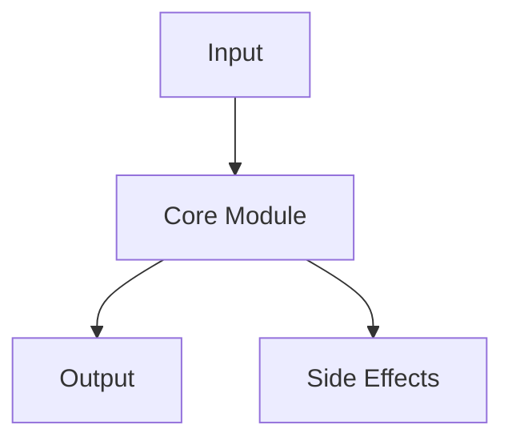

<p align="center">
  
</p>

# [REPO NAME]

> [One-line value proposition — what it does and why it matters. 15 words max.]

[](LICENSE)
[]()
[](https://github.com/frankxai/Starlight-Intelligence-System)

---

## What it is

[3 sentences max. No hype. Concrete nouns only: what it does, what it produces, who uses it.]

---

## Quickstart

```bash
# Minimal working example — copy-paste and run
```

---

## Architecture



---

## Key features

| Feature | Description |
|---------|-------------|
| **Feature 1** | What it does concretely |
| **Feature 2** | What it does concretely |
| **Feature 3** | What it does concretely |

---

## Links

Copy these into your README — replace destinations with your actual paths:

```markdown
- [Documentation](docs/)
- [Contributing](CONTRIBUTING.md)
- [Changelog](CHANGELOG.md)
- [Issues](../../issues)
```

---

<p align="center">
  <sub>Part of the <a href="https://github.com/frankxai/Starlight-Intelligence-System">Starlight Intelligence</a> ecosystem · Built on SIP</sub>
</p>

---

## README standard — usage guide

This template defines the visual identity standard for all 16 Starlight/FrankX repos.

### Required elements

1. **Hero SVG banner** at `.github/assets/hero.svg`
   - 1200×300px, `viewBox="0 0 1200 300"`
   - Background: `#0a0a0b` (void black)
   - Brand palette: emerald `#10b981`, cyan `#06b6d4`, amber `#f59e0b`, gold `#fbbf24`
   - SMIL `<animate>` / `<animateTransform>` for GitHub-native rendering
   - Under 30KB
   - "Built on SIP" footer in amber
   - Visually unique to the repo's purpose

2. **Badge row** — shields.io, consistent across all repos
   - License (MIT or CC-BY-4.0)
   - Status (Active / In Progress / Draft)
   - "Built on SIP" link to Starlight-Intelligence-System

3. **H1 + one-line value prop** — 15 words max, no marketing language

4. **"What it is" section** — 3 sentences, concrete nouns

5. **Quickstart** — copy-paste runnable example

6. **Architecture diagram** — Mermaid, renders natively on GitHub

7. **Key features table** — 3–6 rows, concrete descriptions

8. **Ecosystem footer** — links back to Starlight-Intelligence-System

### Voice rules

- No spiritual/transformation language
- Lead with what it does, not philosophy
- Concrete nouns over abstract claims
- Link to evidence, not assertions

### SVG visual themes by repo type

| Repo type | Suggested visual theme |
|-----------|----------------------|
| Agent/AI system | Network graph with pulsing nodes |
| Ocean/nature | Marine constellation, wave patterns |
| Music/audio | Equalizer bars, musical staff |
| OS/platform | Dashboard panels, terminal cursor |
| Library/skills | Floating cards, skill network |
| Data/evals | Bar charts, score displays |
| Swarm | Honeycomb, distributed nodes |
