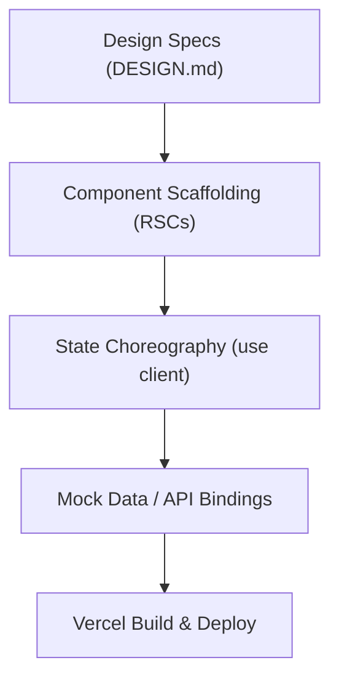

# Next.js & React Expert

This skill guides you through building production-ready, high-taste web applications using Next.js 16 and React 19.

## Core Rules

1. **Server Components by Default**: Keep components on the server (`RSC`) to reduce client-side bundle size. Only add `'use client'` when adding interactivity (states, hooks, event handlers).
2. **Data Fetching**: Use Server Actions or native `fetch` with React 19's caching mechanisms. Avoid legacy `getServerSideProps` or client-side `useEffect` fetching without a proper caching library.
3. **Form Actions**: Leverage React 19's `useActionState` and `useFormStatus` to handle pending states and form submissions naturally.
4. **Performance Budgets**: Maintain image optimization using Next.js `<Image>`, use font optimization via `next/font`, and minimize external JS libraries.

## Workflow

1. **Scaffold RSCs**: Create structural layout and static elements.
2. **Add Interactivity**: Isolate client logic into leaf components using `'use client'`.
3. **Handle State**: Use React 19 hook features for actions and transitions.
4. **Deploy**: Build local test bundles and deploy previews to Vercel.
