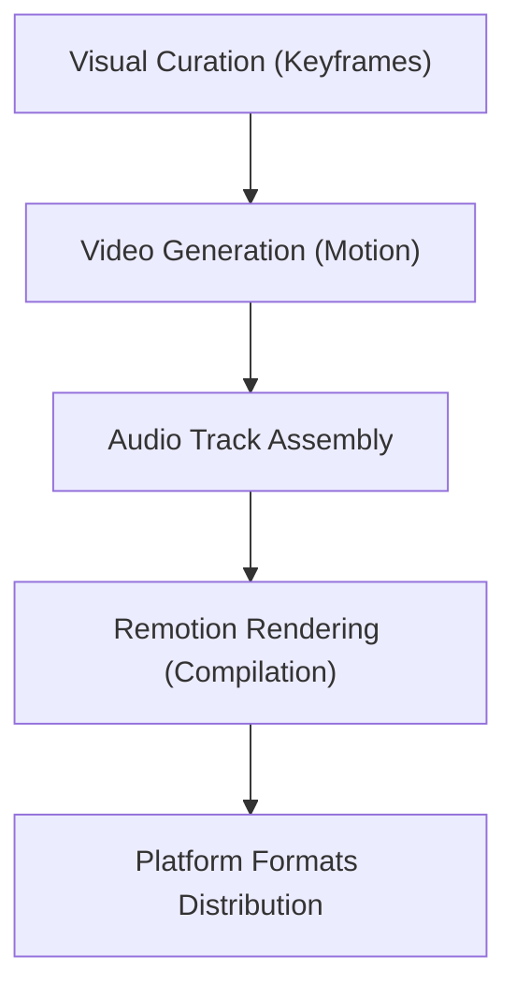

# Video Production Workflow

This skill guides you through automated and programmatic video production.

## Core Rules

1. **3-Layer Production Stack**:
   - **Keyframe Layer**: Establish visual seeds using image generators (Flux/Midjourney).
   - **Motion Layer**: Turn keyframes into cinematic B-roll using video generators (Higgsfield/fal).
   - **Assembly Layer**: Stitch clips, audio tracks, and transitions dynamically using Remotion or FFmpeg.
2. **Audio & Narration**: Integrate clean Whisper-based transcripts, elevenlabs voice overs, and royalty-free audio backdrops.
3. **Platform Formatting**: Output multiple formats concurrently (9:16 vertical shorts, 16:9 landscape explainers, Spotify canvases).

## Workflow

