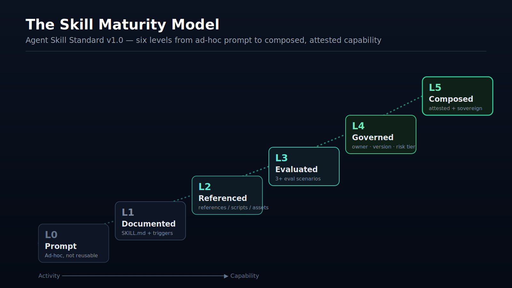

# The Skill Maturity Model

**Part of the Agent Skill Standard v1.0**

A skill is not on or off. It matures through six levels, and each level adds exactly one guarantee the level below it could not make. The model gives a team a shared vocabulary: "this skill is L4" means it is owned, versioned, tiered, and reversible — no meeting required.

| Level | Name | The guarantee it adds | Test to pass |
|---|---|---|---|
| **L0** | Prompt | none — it worked once | (starting line) |
| **L1** | Documented | it has a name and one job | valid `SKILL.md`, hyphen-case `name`, trigger-rich `description` |
| **L2** | Referenced | it scales without bloat | `references/` / `scripts/` / `assets/`; body < ~500 lines |
| **L3** | Evaluated | it works on purpose, not by luck | `evals/` with ≥ 3 scenarios (success, incomplete, misuse) |
| **L4** | Governed | it is owned and reversible | `owner`, `version`, `risk_tier`, `status`, `rollback` |
| **L5** | Composed | it runs safely beside other skills | `composes`, `attestation`, `boundary` + coexistence proof |

## How to read it

- **Match the level to the stakes, not to ambition.** A personal note-summarizer can stay at L2 forever. A skill that touches production data has no business below L4.
- **Risk tier sets the floor; maturity is the climb.** A T3 skill MUST reach L4. A T0 skill MAY stop at L1. The two axes are independent (see `risk_tier` in [SPEC.md](./SPEC.md) §5).
- **L3 is the highest-leverage rung.** It is where a skill stops working by luck. Teams that write eval scenarios early compound faster than teams with larger but unproven libraries.

## Moving a skill up

| Transition | The work |
|---|---|
| L0 → L1 | Write the `SKILL.md`. Spend most of the effort on the `description`. |
| L1 → L2 | Move deep material into `references/` and deterministic checks into `scripts/`. |
| L2 → L3 | Write three eval scenarios. The single most valuable step. |
| L3 → L4 | Add the governance frontmatter and a rollback version. |
| L4 → L5 | Run it inside its real bundle; add `attestation` and a `boundary`. |

## Composition and sovereignty (L5)

L5 is where a skill becomes part of an agent team. It MUST:

- coexist with the other skills in its bundle without degrading routing,
- carry an `attestation` of what it is built on, and
- declare a `boundary` — the data it will read and the actions it will and will not take.

This is the layer where the standard meets [SIP](https://github.com/frankxai/Starlight-Intelligence-System): attestation and an explicit sovereignty boundary are how independent skills compose without one silently overreaching into another's scope.
